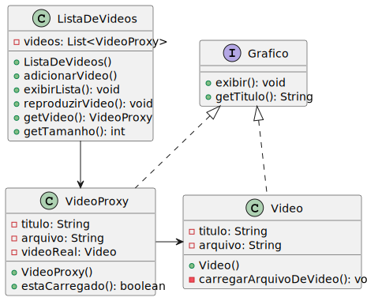

# Proxy (Padrão de Projeto Estrutural)

### Streaming de Vídeos com Carregamento Sob Demanda

Exemplo feito pelo time do Object Pool

## Motivação

Imagine um cenário de uma plataforma de streaming de vídeos onde carregar todos os vídeos de uma vez seria extremamente ineficiente e consumiria muitos recursos. O padrão **Proxy** resolve esse problema permitindo o carregamento sob demanda dos vídeos apenas quando o usuário realmente deseja assisti-los.

O padrão Proxy nesse exemplo fornece um ponteiro para o objeto real, controlando assim o acesso a ele e diminuindo o número de instâncias pesadas que não serão realmente usadas. No nosso exemplo, o `VideoProxy` atua como um representante para o objeto `Video` real, adiando sua criação e carregamento até que seja realmente necessário.

Isso é especialmente útil em situações onde:
- O objeto real é pesado para ser carregado
- O acesso ao objeto real precisa ser controlado
- Funcionalidades adicionais precisam ser adicionadas ao acessar o objeto real

No exemplo em questão, o carregamento de vídeos está sendo representado simplificadamente através de impressões no console. O proxy permite que a lista de vídeos seja exibida rapidamente, enquanto o carregamento real do vídeo só acontece quando o usuário decide reproduzi-lo.

## Estrutura



- **Grafico (Interface)**
  - Define a interface comum para `Video` e `VideoProxy`.

- **Video (Objeto Real)**
  - Implementa a interface `Grafico`.
  - Representa o objeto pesado que consome recursos ao ser carregado.

- **VideoProxy (Proxy)**
  - Implementa a interface `Grafico`.
  - Mantém uma referência para o objeto real.
  - Controla o acesso ao objeto real, criando-o apenas quando necessário.

- **ListaDeVideos (Cliente)**
  - Utiliza objetos `VideoProxy` para gerenciar uma coleção de vídeos.
  - Permite a exibição da lista e reprodução de vídeos específicos.

## Implementação

### Grafico (Interface)

```java
package app;

interface Grafico {
    void exibir();
    String getTitulo();
}
```

### Video (Objeto Real)

```java
package app;

public class Video implements Grafico {
    private String titulo;
    private String arquivo;
    
    public Video(String titulo, String arquivo) {
        this.titulo = titulo;
        this.arquivo = arquivo;
        carregarArquivoDeVideo();
    }
    
    private void carregarArquivoDeVideo() {
        System.out.println("Carregando vídeo de " + arquivo + "...");
        // Simulando um carregamento que consome recursos
        
        try {
            Thread.sleep(1000); // Simulação de 1 segundo para carregar (reduzido para tornar os testes mais rápidos)
        } catch (InterruptedException e) {
            e.printStackTrace();
        }

        System.out.println("Vídeo " + titulo + " carregado completamente!");
    }
    
    @Override
    public void exibir() {
        System.out.println("Reproduzindo vídeo: " + titulo);
    }
    
    @Override
    public String getTitulo() {
        return titulo;
    }
}
```

### VideoProxy (Proxy)

```java
package app;

public class VideoProxy implements Grafico {
    private String titulo;
    private String arquivo;
    private Video videoReal;
    
    public VideoProxy(String titulo, String arquivo) {
        this.titulo = titulo;
        this.arquivo = arquivo;
    }
    
    @Override
    public void exibir() {
        // Carrega o vídeo real apenas quando necessário
        if (videoReal == null) {
            videoReal = new Video(titulo, arquivo);
        }
        videoReal.exibir();
    }
    
    @Override
    public String getTitulo() {
        return titulo;
    }
    
    // Método para verificar se o vídeo já foi carregado
    public boolean estaCarregado() {
        return videoReal != null;
    }
}

```

### ListaDeVideos

```java
package app;

import java.util.ArrayList;
import java.util.List;

public class ListaDeVideos {
    private List<VideoProxy> videos;
    
    public ListaDeVideos() {
        videos = new ArrayList<>();
    }
    
    public void adicionarVideo(String titulo, String arquivo) {
        videos.add(new VideoProxy(titulo, arquivo));
    }
    
    public void exibirLista() {
        System.out.println("\n=== LISTA DE VÍDEOS DISPONÍVEIS ===");
        for (int i = 0; i < videos.size(); i++) {
            System.out.print((i + 1) + ". ");
            System.out.println(videos.get(i).getTitulo());
        }
        System.out.println("=================================\n");
    }
    
    public void reproduzirVideo(int indice) {
        if (indice >= 1 && indice <= videos.size()) {
            System.out.println("\n[USUÁRIO CLICOU NO VÍDEO " + indice + "]");
            videos.get(indice - 1).exibir();
            System.out.println();
        } else {
            System.out.println("Índice de vídeo inválido!");
        }
    }
    
    public VideoProxy getVideo(int indice) {
        if (indice >= 1 && indice <= videos.size()) {
            return videos.get(indice - 1);
        }
        return null;
    }
    
    public int getTamanho() {
        return videos.size();
    }
}

```

